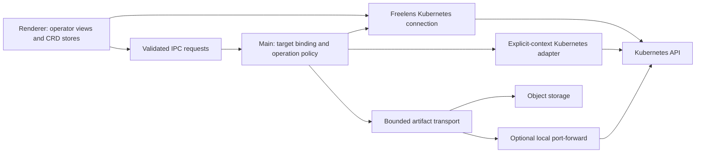

# Architecture

Date: 2026-09-25

Status: T0.3-T0.6 complete; the main request/download proof has local runtime evidence.
SPEC-0001 remains Approved because actual-host activation is unverified. Feature UI,
catalog/IPC integration and general authentication support are not implemented.

Authority: [directives](../../AGENTS.md), [roadmap](ROADMAP.md), and
[versioned evidence](RECON-T0.1.md). The evidence report pins Velero v1.18.2,
AWS plugin v1.14.2, and Freelens v1.10.3. A reviewed version is not a compatibility
claim for untested releases. Product behavior below requires spec approval.

## Boundaries

The extension runs inside Freelens; it adds no server, relay workload, or dashboard
to an operator's cluster. Velero and its storage plugin already run there.

| Area | Owns | Must not own |
| --- | --- | --- |
| Renderer | Native lists, dedicated operation workspace, navigation, forms, local presentation state | Kubeconfig/credentials, signed URLs, direct network downloads, write authorization |
| Common | Typed DTOs, runtime-validation contracts, pure phase/progress/reference helpers | Electron/React side effects, sockets, file access, unscoped global state |
| Main | Target resolution, create-only operations, write policy, request ownership, artifacts, cancellation, transport | Arbitrary renderer-supplied URLs, kubeconfig paths, raw manifests, or cluster fallbacks |

Use the host-provided React 17, MobX and extension APIs. Start from the official
example's build conventions; align SDK and runtime to the pinned host in T0.3.
Select additional dependency versions explicitly and lock them during scaffold.
Prefer established libraries for Kubernetes, runtime validation, and cron parsing.
Do not introduce a new application framework or a parallel state-management system.

### Scaffold Progress

T0.3 establishes a prerelease package built against SDK v1.10.3, using the official
example's pnpm/TypeScript/electron-vite conventions. The manifest accepts the hosts
compatible with v1.10.3; Freelens v2 is explicitly outside the current compatibility
target. Biome, Knip and Trunk run through `pnpm dlx` at the exact versions the
scripts name, as in the other extensions.
Activation remains inert in both main and renderer subclasses of the host SDK.
T0.6 additionally exports the main diagnostic modules for compiled contract tests;
no service, request, IPC handler or feature view is registered on activation.
The renderer is built through electron-vite's preload target to produce the CommonJS
module the host expects. A small build adapter maps the SDK's three root namespaces
directly to `global.LensExtensions`, without loading or bundling the SDK implementation.

Source lifecycle tests use process-specific host stubs that reject Kubernetes,
catalog and IPC access. Compiled-entry tests load the actual generated CommonJS
modules against those stubs. The canonical unit command builds first so these checks
cannot pass against missing output; focused source tests may run directly in Vitest.
This contract test does not substitute for installation into real Freelens.
Type checking and build are explicitly chained in the scripts: the selected pnpm
configuration does not execute implicit pre/post hooks, so correctness cannot depend
on prebuild or pretest hooks running.
Knip development checks source dependencies; its strict production mode checks the
compiled main/renderer entries. The host SDK is a development-only type/build input,
not an extension runtime dependency to install or bundle.
The SDK's permissive type peer otherwise resolves to React 19 declarations. Pin
React 17 declarations explicitly to match the selected host; this adds no renderer UI.
Generated entries are included explicitly in production analysis despite Git ignores.

The hosted checks are the ones of the other extensions of the organization, on
every pull request and on main: production build, type check, lint and Knip; Trunk;
the unit tests, on the build with separate modules and on the production build;
the integration tests, which install the packed production build in a Freelens
v1.10.3 built for the purpose; the end-to-end tests, which bring the test
environment up on the runner, run the fixtures and the transport proof and take
it down; OSV-Scanner. They run on synthetic data only. Renovate and the daily maintenance
workflows of the organization (npm audit, npm dedupe, Biome migrate, Trunk upgrade)
open their pull requests on branches named `automated/*`. A release is three
workflows: the version workflow opens the pull request that sets the version, the
tag workflow tags main when that pull request is merged, the release workflow
builds the production bundle from the tag, publishes it to npm and attaches the
tarball, its checksums and its software bill of materials to the GitHub release.

### Dependencies

The graph carries no override and no patch. What is bundled, what only builds, and
the history of the overrides of the first weeks are in
[DEPENDENCY-AUDIT.md](DEPENDENCY-AUDIT.md).

T0.6 adds exact official packages `@kubernetes/client-node` 2.0.0 and `ws` 8.21.3,
plus `@types/ws` 8.18.1. The first two are main runtime libraries bundled from
development declarations; the host SDK/React remain external. The client is
imported by its distributed files, `dist/config.js` and `dist/web-socket-handler.js`,
never from its root, which would bundle every generated API client. These deep
imports are version-pinned and tested, not a host private API. Revalidate them
before changing the client version. The main build replaces undici with
[a stub](../../build/undici-stub.ts): the client imports it for API clients this
extension never calls, and the real module installs a dispatcher for the whole
process when it loads, which inside Freelens is the process of the host. Supported
`WS_NO_*` build defines disable optional native accelerators without patching the
library. The 276 normal/production tests cover 14 scaffold, 96
environment/fixture, 48 diagnostic contracts and 118 of the operation states. The integration test covers the
installation in the host.
The electron-vite warning about a missing standalone renderer
configuration is expected: this extension intentionally builds its renderer through
the preload target, whose generated entry is covered by the bundle tests.

### Lessons Adopted From The Other Extensions

- CRD enumeration can itself be forbidden. A failed CRD list is not evidence that
  Velero is absent; support explicitly configured namespaces and truthful RBAC states.
- Forwarding helpers with a permissive fallback and cleanup do not belong in a
  multi-cluster recovery tool. Fail closed on target resolution and own every
  socket, timeout, cancellation, and partial failure.
- A promise timeout does not necessarily abort network I/O. Download deadlines must
  terminate the request, decompression, polling, and any tunnel they own.
- A signed URL points to object storage, not to a Velero HTTP service. No separate
  Velero service endpoint or extraction of S3 credentials is needed for downloads.

## Target And State Model

- Installation identity is the pair of catalog cluster ID and Velero namespace.
  Object identity adds API version, kind, name, and UID. A name alone is never a key.
- Every request has an opaque request ID and a selection generation. Main binds it
  to the IPC sender, resolved cluster identity, namespace, operation, and object UID.
- Cluster or installation changes clear pending confirmations, disable write mode,
  and cancel owned diagnostic work. Ignore late results from older selections.
  Cancelling a UI wait does not undo a Kubernetes operation already submitted.
- Recreated objects with the same name are different targets. Refetch UID and
  relevant resourceVersion immediately before submission; a changed object requires
  a fresh review. Never silently switch to another backup or installation.
- Cache resource metadata only in memory, scoped to installation. Keep stale values
  visible with their last-success time during refresh; never relabel a failed refresh
  as a successful read. Drop cached data on session disposal or authorization loss.
- Persist only explicit non-secret preferences in the host's local extension store:
  namespace selection, filters, column layout, and approved connection settings.
  Diagnostic payloads, signed URLs, operation confirmations, and write enablement
  are not persisted. No telemetry or remote logging is added.

## Kubernetes Access

### Reads And Discovery

Use renderer CRD stores and public `Main.K8s` reads where their response and error
contracts are sufficient. Model classes expose static metadata and typed spec/status;
derive behavior with pure helpers rather than extension-specific instance methods.

Opening Velero inspects only the selected cluster. CRD/API discovery establishes
API availability, not that a controller is healthy. A permitted BSL list suggests
installation namespaces; configured namespaces support restricted RBAC and incomplete
installs. Do not scan every catalog cluster or hard-code `velero` as the only choice.

| Evidence | Result |
| --- | --- |
| Successful authoritative discovery with no Velero APIs | Not installed |
| Some expected APIs absent | Incomplete API installation; identify affected views |
| List succeeds with zero objects | Empty result in the queried scope |
| Discovery/list is forbidden | Access restricted, not absent or empty |
| BSL list is empty or unavailable | Installation namespace may still be configured |
| Generic host error with no reliable status | Unknown/error, never guessed 403 or 404 |

If precise API discovery/status codes need the direct main adapter, use the same
explicit target contract below and document the path; do not parse English error
strings. Do not create SelfSubjectAccessReview, diagnostic requests, or other API
objects merely to render read-only views. A not-yet-tested write permission is
unknown, not granted; the actual API decision is authoritative.

### Create-Only Adapter Decision

The pinned public `Main.K8s` does not export generic execute/create. Its apply helper
can update existing objects and cannot be assumed to support generateName safely.

Product decision: a small main-only adapter using `@kubernetes/client-node` and the
catalog entry's original kubeConfigPath plus contextName. Resolve both in main,
require the named context to exist, and fail closed if the file, context, or current
catalog identity does not match. Never load a default kubeconfig, choose an active
or first cluster, accept a path from renderer, or fall back through the proxy.

- Create uses a namespaced POST, never apply or PUT. Build allowlisted object types
  from validated operation parameters in main; do not expose a generic CRUD IPC API.
- Preserve API-generated names for DeleteBackupRequest and ServerStatusRequest.
  DownloadRequest uses the verified target-plus-UUID naming contract, with DNS name
  length validation. A name collision must not update the existing resource.
- Track each submission locally. Repeated request IDs rejoin the same in-flight
  operation rather than creating duplicates. Do not blindly retry POST after an
  ambiguous connection loss: report an unknown submission result and reconcile the
  identified request before another user-approved attempt.
- Use read requests to poll the created object. If cancellation cannot be propagated
  through the selected client version, the adapter must own an abortable transport;
  a rejected timeout promise alone is insufficient.
- For CRD patches, request explicit merge/JSON patch semantics. The host's default
  strategic patch is unsuitable. Use resourceVersion or JSON-patch tests for
  conflict-sensitive changes, and never replace the whole object from stale UI state.
- Future kubeconfig auth-provider/exec integration must use only the explicitly
  selected existing configuration. Do not invent login fallbacks, store tokens,
  log configuration, or send credentials across IPC. The T0.6 proof deliberately
  rejects these plugins, proxies, basic authentication and insecure TLS; it accepts
  explicit client certificates or tokens only. This limitation is not a reduction
  of the later connection-integration requirements.

The implemented [adapter](../../src/main/diagnostic-kubernetes.ts) uses the official
client for explicit kubeconfig/authentication and owns abortable native HTTPS
GET/POST calls: 10-second deadline, 4 MiB JSON bound, verified TLS and no upsert.
It checks the file hash/context before and after requests and validates exact
namespace/name plus UID presence on reads. A malformed or lost POST response has
an unknown submission outcome, not an automatic retry. The service reconciles only
the named DownloadRequest and checks its ownership/target before reuse.

T0.6 proves certificate authentication, actual generated ServerStatusRequest names
and 409 preservation on local kind; token/refusal/cancellation and ambiguous POST
cases have loopback coverage. Actual catalog resolution, credential-plugin execution
and Electron sender authentication remain unverified. No private host API or default
kubeconfig fallback is used.

## IPC, Errors, And Write Policy

All privileged operations require a runtime-validated discriminated request. Accept
cluster ID, namespace, object identity, approved operation parameters, and request
ID; reject unknown fields and malformed or oversized payloads. Authenticate ownership
through the actual IPC sender and deny a request if sender/target binding cannot be
established. A TypeScript interface or a renderer checkbox is not authorization.

Write mode is off by default and session-only, scoped to cluster and installation.
Main enforces it. Every create/patch/delete also needs an operation-specific review
and explicit confirmation containing context and namespace. Diagnostic reads that
create DownloadRequest or ServerStatusRequest use this policy too. Switching target,
disabling writes, expiry, or object changes invalidates pending approvals.

Represent results as typed success or errors with codes such as validation,
not-installed, forbidden, not-found, conflict, cancelled, deadline, submission-unknown,
artifact-missing, transport-unreachable, tls-invalid, destination-denied, and
payload-too-large. Carry stage, retry safety, and safe presentation text separately.
Never forward raw client errors, request/response bodies, headers, paths, or URLs.
An unknown underlying error remains unknown, not a fabricated storage diagnosis.

The extension-owned Backup list, context menu, drawer toolbar and bulk controls must
not expose generic edit/delete. Use the pinned public overrides and menu handlers;
verify every path in the packaged app. Product policy is not a replacement for RBAC
or a guarantee against operations performed outside this extension.

## Artifact Service

Allow only BackupLog, RestoreLog, BackupResults, RestoreResults, BackupResourceList,
RestoreResourceList, BackupVolumeInfos, and RestoreVolumeInfo. Reject BackupContents
and every other target in main, even if supplied directly through IPC.

Lifecycle: validate target and confirmation -> create request -> wait for URL or
explicit failure -> authorize destination -> fetch/decompress -> deliver bounded
content -> release owned resources. No background prefetch on row hover, selection,
refresh, or opening a detail page. New/Processed-only servers need a client deadline.
Processed does not prove a file exists; a missing artifact is distinct from a failed
storage connection. Cancellation stops local work, not Velero's controller.

Do not silently delete Kubernetes requests when the user cancels. Prefer the
controller's expiry cleanup; a stopped controller may leave a request behind, which
must be reported truthfully. Any client-side deletion of an owned request requires
explicitly disclosed write authorization and UID checks. Test-fixture cleanup is
separately authorized local kind work, not a product permission bypass.

Implemented proof bounds; later product changes require explicit evidence/spec revision:

| Limit | T0.6 implementation |
| --- | --- |
| Polling | 250 ms fixed by default; main may select an interval up to 1 s; maximum 30 s waiting for a URL |
| Connect/TLS establishment | 10 s |
| Inactive download | 15 s |
| Whole diagnostic operation | 120 s, including polling |
| Compressed / decompressed bytes | 16 MiB / 64 MiB per artifact |
| Concurrent artifact operations | 2 globally; queued work remains cancellable |

The fixed polling interval is the proof's simplification of the initial backoff
proposal, not an increased request or duration budget. One service permits at most
16 active/queued operations and 32 pending confirmations. Main approvals expire
after 30 seconds and bind the sender and exact target; in-flight IDs deduplicate
and the last 256 completed IDs cannot be replayed. Target invalidation aborts work
and clears write mode. Actual IPC must supply the sender; accepting a renderer's
claimed sender would not satisfy this contract.

Stream with backpressure and explicit decompression limits; parsing/rendering also
needs bounded memory. A limit stops the operation with an explicit incomplete/error
state, never a successful partial JSON result. Do not automatically retry and create
another request. Structured payload contracts are established from synthetic local
artifacts before shipping viewers; no schema is invented from a screenshot.

Signed URLs remain main-only, transient, and redacted from errors. Validate scheme,
host, port, userinfo, fragment, target association, and exact permitted storage origin.
BSL contents and DownloadRequest status are inputs, not blanket destination trust.
Reject redirects by default. Reject metadata, link-local, unspecified and multicast
destinations; validate DNS results at connection time against rebinding. Permit a
private storage endpoint only through an explicit target-scoped policy. A loopback
destination is allowed only for a main-owned tunnel or isolated synthetic test server.

HTTPS is the default. Plain HTTP requires explicit per-target approval and a visible
security state, never an automatic downgrade. Preserve signed authority/path/query;
do not append authentication headers or rewrite a signed URL as a new REST URL.
Use system trust plus BSL inline caCert or caCertRef. Fetch only the referenced Secret
in the correct namespace, extract its certificate key in main, and discard the rest.
Kubernetes RBAC restricts access to a Secret object, not an individual key; disclose
that boundary. Denied certificate reads do not enable insecure fallback.

Prefer direct access to an already reachable signed origin. For a recognized
in-cluster object store, an explicitly selected Service/pod tunnel may change the
socket destination while preserving HTTP Host and TLS SNI. Do not create relay pods
or alter BSL publicUrl. Refuse ambiguous endpoint/service mappings. T0.6 provides
Host, path/query, CA and cancellation evidence for explicit forwarding.
The T0.6 support decision below covers explicit routing only; it does not claim
automatic service discovery or that every cluster endpoint is reachable.

### T0.6 Transport Support Decision

- Reuse [DiagnosticService](../../src/main/diagnostic-service.ts), the create-only
  adapter, [bounded transport](../../src/main/diagnostic-transport.ts) and
  [pod tunnel](../../src/main/diagnostic-tunnel.ts) for the later diagnostic slice.
  Accept eight target kinds, but only the four log/results kinds have real artifact
  format evidence so far. No BackupContents or credential extraction is provided.
- Direct HTTPS connects to a main-authorized numeric address while preserving the
  original Host, raw path/query, TLS SNI and certificate hostname. There is no DNS
  lookup inside the downloader. Main's later resolver must authorize the origin,
  artifact path and resolved address, including DNS/rebinding checks. Renderer URLs
  or a BSL value alone are not authorization. Metadata/unsafe addresses and redirects
  are refused, and private addresses need explicit main policy.
- Forwarding uses the explicit namespace, Pod name/UID and declared port after a
  Ready check. A single-use loopback listener owns the Kubernetes WebSocket from
  handshake onward. Cancellation covers pod lookup, listener startup, handshake
  and data I/O; cleanup closes TCP, WebSocket and listener. It never chooses the
  first Pod, creates a relay workload or rewrites BSL publicUrl. When the pod side
  closes first the relay still delivers what it sent, then closes the local socket.
  It pauses the WebSocket while more than 256 KiB wait for the local socket, for
  frames of any size.
- Local proof: four log/results downloads in each of HTTP tunnel, HTTPS tunnel
  with inline CA, HTTPS tunnel with referenced CA, and direct HTTPS with referenced
  CA. Changed signature and HTTP Host are rejected by authenticated storage;
  HTTPS without its private CA is rejected. CA access is same-namespace and only
  the selected certificate is returned. No insecure retry/override is implemented.
- A pinned official Node container shares only the owned local node's network for
  the direct proof; it mounts the code/config read-only and inherits isolation.
  It is a test runner, not an extension workload or derived image. The production
  product must report unreachable routes honestly until its resolver is qualified.

The compiled CommonJS main is exercised under Node with minimal host stubs, not
inside Electron. Failure/expiry/404 and byte/deadline cases have contract-server
coverage; not every negative is induced against the live controller/store.
See [the evidence matrix](TESTING.md#t06-main-transport-proof). No feature gate or
actual-host acceptance is closed merely by exporting these modules.

The accepted [T0.4 local-storage selection](LOCAL-STORAGE.md) uses SeaweedFS 4.47 with
explicit authentication, disabled telemetry and isolated internal services. The
[manifest generator](../../e2e/scripts/local-manifests.mts) encodes these settings;
storage and Velero were installed and passed T0.4 readiness checks on 2026-09-24.
The BSL is Available. T0.5 proves the synthetic ConfigMap backup/restore flow;
T0.6 adds the scoped compiled-main signed-download evidence above.
This choice introduces no storage-server dependency into the extension itself.

The [setup runner](../../e2e/scripts/local-demo.mts) keeps credentials, kubeconfig,
CLI caches and an ownership journal outside repository worktrees. Every Kubernetes
operation verifies the node/network identity and kubeconfig hash. The internal
Docker network has no published API port: official `kind get kubeconfig --internal`
supplies the identity, then only its server hostname is replaced by the verified
node IP. TLS remains verified; no global context or default kubeconfig is changed.
Where the host cannot reach the address of the node, as with Docker Desktop, the
network is not internal and the API server is published on `127.0.0.1` only: the
egress rules of the node, installed before the first workload, hold the node back.
The identity check accepts these two shapes and nothing else. The processes that
run inside the network of the node use a second kubeconfig, with the address of
the node. kind and kubectl are the pinned official releases, installed under the
private state after a checksum check. See
[SPEC-0004](../specs/SPEC-0004-test-environment-every-platform.md).

The images are unmodified official releases, pulled for the platform of the Docker
daemon from pins that are indexes with `linux/amd64` and `linux/arm64`. Since
Docker archive import does not preserve the registry index reference, the scripts
import the archive of the official version tags into the node after their digest
check. The node must name each image by the configuration the pinned index gives
for the platform, whichever image store Docker uses, before deployment. Workloads
use `imagePullPolicy: Never`. Official Velero CLI output is generated without network
access, then checked for the expected namespace, images and local S3 endpoint.
The 13 CRD schemas remain unchanged. Cloud snapshots are disabled in this lab.

Master/filer/volume ports bind to pod loopback. Official SeaweedFS also listens on
S3 gRPC port 18333; node OUTPUT/FORWARD rules block it outside the pod while S3
8333 stays reachable. Node-local rules, a service-CIDR route and cluster-only DNS
support local traffic without adding a default route. The resolver of Docker, which
answers for names outside the cluster, is refused to the node and to its pods. The
rules are the first of their parent chains and are installed again when the node
restarts, before its workloads run. A helper container on the
owned network, from the pinned Node.js image, answers a request from the network;
then node and pod are refused when they call it as an address outside the cluster,
proven with the firewall counters, not timeouts alone.

Resource creation refuses collisions; reapply binds UID, and temporary cleanup uses
DELETE UID preconditions. The live interrupted-check scenario preserves a sentinel
and removes only its own ConfigMaps. The reusable environment stays running with
restart disabled. The [official-artifacts directive](../../AGENTS.md#official-artifacts-and-scope)
remains binding: no custom-image use, upstream repair or scan gate. See [TESTING.md](TESTING.md).

T0.5 [fixture factories](../../e2e/scripts/local-fixtures.mts) distinguish live
resources from forced states with run and mode labels. Each run owns separate
source, restore-destination and static namespaces. The static namespace is outside
the configured server/node-agent scope; ordinary resource status patches are read
back against unchanged CRD schemas and their UIDs/resourceVersions remain stable
while a real backup and restore execute in the installation namespace.

The live flow selects only labelled ConfigMaps from its source namespace, disables
cluster resources and volume snapshots, and restores into a pre-created owned
destination with policy `none`. Thirteen ConfigMaps include 9 MiB of random synthetic
payload; restored hashes match. S3 archive metadata proves multipart without a
client archive download. The fixture client reads only bounded log/results objects
with generated local credentials. That T0.5 fixture-only path creates no
DownloadRequest and obtains no presigned URL. T0.6 instead creates requests through
the main adapter and consumes server-signed URLs without reading S3 credentials.

A temporary namespace-scoped ServiceAccount credential proves real RBAC denials
without administrative fallback. Its kubeconfig is removed; cleanup deletes the
ServiceAccount and role objects with their owned namespace. A single `fixtures`
command runs the steps and invokes cleanup in `finally`. Real backup removal uses
DeleteBackupRequest bound to the backup UID; the controller removes associated
Restore resources and stored artifacts. Namespace cleanup inventories all listable
resources and refuses foreign entries before its UID-preconditioned delete. No
direct API deletion of the real Backup or initialized cluster is used.

The guarded `start` command resumes only the unchanged stopped node, then checks
authenticated API liveness and restores local isolation. It is not permission to
select or recreate another cluster. Private reports and synthetic diagnostic
captures remain outside the repository; the retained environment is revalidated
after fixture cleanup.

The `transport-proof` action temporarily enables the official storage server's
supported HTTPS listener, then restores its original Deployment, Service and BSL.
It waits for BSL Available before controller-mediated fixture deletion, removes
only owned request/Secret UIDs, and deletes temporary certificate files and its
direct runner container. A report cannot become `pass` until cleanup and the
fixture-free verifier succeed. Signed URLs are never written to the report or CLI
logs; cleanup lists metadata only and suppresses request DELETE response bodies.

## Schedule And Action Design Constraints

- Adherence compares expected submissions with observed matching backups, not with
  a claimed successful recovery point. Account for lastSkipped, pauses, in-flight
  work, incomplete history and clocks. Use an established parser compatible with
  the reviewed cron dialect, including descriptors and TZ/CRON_TZ prefixes.
- Never inherit the desktop timezone silently. For an unqualified expression,
  require a known installation timezone or report expected-run/adherence as unknown
  while still showing actual timestamps. Final UX belongs to the adherence spec.
- A restore review must show the concrete source and exact namespace/resource policy.
  Proposed safest flow resolves a schedule to a concrete completed Backup for review
  and submits backupName after UID revalidation. If server-side schedule selection
  is offered instead, explicitly show that the source can change before execution.
- Default existing-resource policy to none, exclude cluster-scoped resources unless
  explicitly selected, and require a deliberate namespace selection/mapping.
  Do not label a preview as a dry run or a guarantee of every object affected.
- Pause/resume includes an explicit immediate-run policy. Backup deletion creates
  one DeleteBackupRequest and checks its errors; Processed alone is not success.

These constraints preserve the agreed feature scope. Detailed action specs are
authored before their respective implementation steps, not implicitly approved here.

## Security And Verification Ownership

| Risk | Boundary | Required proof |
| --- | --- | --- |
| Wrong cluster/namespace or stale object | Main resolution, sender binding, UID and review invalidation | Equal names in two installs; switch while request is pending |
| Unintended write or duplicate submission | Main write gate, create-only adapter, request dedupe | Off-by-default rejection, collision, ambiguous POST |
| Signed-URL disclosure or SSRF | Main transport and sanitized error DTOs | URL sentinel absent from output; denied origins, redirects and rebinding |
| Secret or backup-content exposure | Target allowlist, certificate isolation | BackupContents rejected; certificate/other Secret keys absent from IPC |
| Hung or oversized artifacts | Abortable bounded pipeline | Timeout, disconnect, decompression bomb, cancellation and no leaked sockets |
| Misleading health | Pure lifecycle/evidence model | Every phase, missing fields, failed refresh and partial RBAC |

The binding development/privacy boundary is [AGENTS.md](../../AGENTS.md).
All runtime proofs use local kind and synthetic artifacts; this design does not
authorize an external environment. See [TESTING.md](TESTING.md) for the evidence gates
and [DESIGN.md](DESIGN.md) for presentation contracts.
