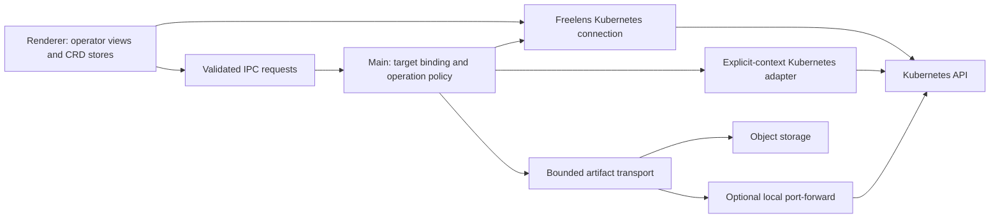

# Architecture

Date: 2026-09-30

Status: the foundation is complete and the first views are in place: the discovery of
the installation, the Backups, the Restores, the Schedules and the storage and
snapshot locations, read only; and the gate of the writes, with the way between the
processes. The diagnostics and the actions are not implemented: their sections below
are the design their specs start from.

Authority: [directives](../../AGENTS.md), [roadmap](ROADMAP.md), and
[versioned evidence](RECON-T0.1.md). The evidence report pins Velero v1.18.2,
AWS plugin v1.14.2, and Freelens v1.10.3. A reviewed version is not a compatibility
claim for untested releases. Product behavior below requires spec approval.

## Boundaries

The extension runs inside Freelens; it adds no server, relay workload, or dashboard
to an operator's cluster. Velero and its storage plugin already run there.

| Area | Owns | Must not own |
| --- | --- | --- |
| Renderer | Native lists, dedicated operation workspace, navigation, forms, local presentation state | Kubeconfig/credentials, signed URLs, direct network downloads, write authorization |
| Common | Typed DTOs, runtime-validation contracts, pure phase/progress/reference helpers | Electron/React side effects, sockets, file access, unscoped global state |
| Main | Target resolution, create-only operations, write policy, request ownership, artifacts, cancellation, transport | Arbitrary renderer-supplied URLs, kubeconfig paths, raw manifests, or cluster fallbacks |

Use the host-provided React 17, MobX and extension APIs. Start from the official
example's build conventions; align SDK and runtime to the pinned host in T0.3.
Select additional dependency versions explicitly and lock them during scaffold.
Prefer established libraries for Kubernetes, runtime validation, and cron parsing.
Do not introduce a new application framework or a parallel state-management system.

### Scaffold Progress

T0.3 establishes a prerelease package built against SDK v1.10.3, using the official
example's pnpm/TypeScript/electron-vite conventions. The manifest accepts the hosts
compatible with v1.10.3; Freelens v2 is explicitly outside the current compatibility
target. Biome, Knip and Trunk run through `pnpm dlx` at the exact versions the
scripts name, as in the other extensions.
Activation asks nothing of a cluster, in either process. Both open the store of the
preferences; the renderer registers the pages of the Backups, of the Restores, of
the Schedules, of the Backup Storage Locations and of the Volume Snapshot
Locations, their entries of the sidebar and the sections it adds to the details
the host shows of each of the five kinds.
T0.6 additionally exports the main diagnostic modules for compiled contract tests;
no service, request or IPC handler is registered on activation.
The renderer is built through electron-vite's preload target to produce the CommonJS
module the host expects. A [build adapter](../../build/host-globals.ts) maps what the
host provides to the globals it provides it under, without loading or bundling any of
it: the SDK in both processes, MobX in both, React, its DOM and its JSX runtime and
the bindings of MobX for React in the renderer. A build test fails when one of them is
found in the output.

Source lifecycle tests use process-specific host stubs that reject Kubernetes,
catalog and IPC access. Compiled-entry tests load the actual generated CommonJS
modules against those stubs. The canonical unit command builds first so these checks
cannot pass against missing output; focused source tests may run directly in Vitest.
This contract test does not substitute for installation into real Freelens.
Type checking and build are explicitly chained in the scripts: the selected pnpm
configuration does not execute implicit pre/post hooks, so correctness cannot depend
on prebuild or pretest hooks running.
Knip development checks source dependencies; its strict production mode checks the
compiled main/renderer entries. The host SDK is a development-only type/build input,
not an extension runtime dependency to install or bundle.
The SDK's permissive type peer otherwise resolves to React 19 declarations. Pin
React 17 declarations explicitly to match the selected host, and the libraries the
host provides at the versions it provides them: they are what the tests of the views
run against, and none of them is installed with the extension.
The declarations of the SDK come from `@freelensapp/core`, a development dependency
the paths of `tsconfig.json` point to: without it the resolution of the bundler takes
the JavaScript of the SDK and leaves its types out.
Generated entries are included explicitly in production analysis despite Git ignores.

The hosted checks are the ones of the other extensions of the organization, on
every pull request and on main: production build, type check, lint and Knip; Trunk;
the unit tests, on the build with separate modules and on the production build;
the integration tests, which install the packed production build in a Freelens
v1.10.3 built for the purpose; the end-to-end tests, which bring the test
environment up on the runner, run the fixtures and the transport proof and take
it down; the tests of the views, which run their suites in that Freelens against
the fixtures of that environment; OSV-Scanner. They run on synthetic data only. Renovate and the daily maintenance
workflows of the organization (npm audit, npm dedupe, Biome migrate, Trunk upgrade)
open their pull requests on branches named `automated/*`. A release is three
workflows: the version workflow opens the pull request that sets the version, the
tag workflow tags main when that pull request is merged, the release workflow
builds the production bundle from the tag, publishes it to npm and attaches the
tarball, its checksums and its software bill of materials to the GitHub release.

### Dependencies

The graph carries no override and no patch. What is bundled, what only builds, and
the history of the overrides of the first weeks are in
[DEPENDENCY-AUDIT.md](DEPENDENCY-AUDIT.md).

T0.6 adds exact official packages `@kubernetes/client-node` 2.0.0 and `ws` 8.21.3,
plus `@types/ws` 8.18.1. The first two are main runtime libraries bundled from
development declarations; the host SDK/React remain external. The client is
imported by its distributed files, `dist/config.js` and `dist/web-socket-handler.js`,
never from its root, which would bundle every generated API client. These deep
imports are version-pinned and tested, not a host private API. Revalidate them
before changing the client version. The main build replaces undici with
[a stub](../../build/undici-stub.ts): the client imports it for API clients this
extension never calls, and the real module installs a dispatcher for the whole
process when it loads, which inside Freelens is the process of the host. Supported
`WS_NO_*` build defines disable optional native accelerators without patching the
library. The 1719 tests of the unit run, on the separate modules and on the
production build, are 17 of the scaffold, 123 of the environment and its fixtures,
161 of the diagnostic contracts, 151 of the operation states and of their stages,
55 of the rules of the discovery, 206 of what the views show of a backup, of a
restore and of a schedule, of what they refer to and of the views in the address,
141 of what they show of a location, of its durations and of what uses it, 38 of
what the Overview says of an installation and of the line of time, 33 of the state
of an installation and of its reader, 223 of the components, 126 of the gate of
the writes, of the way between the processes and of the credential of a context,
95 of the version of the server: its comparison, its plugins, the state of its
request, its band, the confirmation of one write and the object the cluster is sent,
106 of the request for an artifact: its way, its words, its text in pages, its
procedures and the object the cluster is sent, and 244 of the addresses a download
connects to: their written forms, their ranges and what an IPv6 address carries. The
integration test
covers the installation in the host, the suites of the views what the views do
in it.
The electron-vite warning about a missing standalone renderer
configuration is expected: this extension intentionally builds its renderer through
the preload target, whose generated entry is covered by the bundle tests.

### Lessons Adopted From The Other Extensions

- CRD enumeration can itself be forbidden. A failed CRD list is not evidence that
  Velero is absent; support explicitly configured namespaces and truthful RBAC states.
- Forwarding helpers with a permissive fallback and cleanup do not belong in a
  multi-cluster recovery tool. Fail closed on target resolution and own every
  socket, timeout, cancellation, and partial failure.
- A promise timeout does not necessarily abort network I/O. Download deadlines must
  terminate the request, decompression, polling, and any tunnel they own.
- A signed URL points to object storage, not to a Velero HTTP service. No separate
  Velero service endpoint or extraction of S3 credentials is needed for downloads.

## Target And State Model

- Installation identity is the pair of catalog cluster ID and Velero namespace.
  Object identity adds API version, kind, name, and UID. A name alone is never a key.
- Every request has an opaque request ID and a selection generation. Main binds it
  to the IPC sender, resolved cluster identity, namespace, operation, and object UID.
- Cluster or installation changes clear pending confirmations, disable write mode,
  and cancel owned diagnostic work. Ignore late results from older selections.
  Cancelling a UI wait does not undo a Kubernetes operation already submitted.
- Recreated objects with the same name are different targets. Refetch UID and
  relevant resourceVersion immediately before submission; a changed object requires
  a fresh review. Never silently switch to another backup or installation.
- Cache resource metadata only in memory, scoped to installation. Keep stale values
  visible with their last-success time during refresh; never relabel a failed refresh
  as a successful read. Drop cached data on session disposal or authorization loss.
- Persist only explicit non-secret preferences in the host's local extension store:
  namespace selection, filters, column layout, and approved connection settings.
  Diagnostic payloads, signed URLs, operation confirmations, and write enablement
  are not persisted. No telemetry or remote logging is added.

## Kubernetes Access

### Reads And Discovery

Use renderer CRD stores and public `Main.K8s` reads where their response and error
contracts are sufficient. Model classes expose static metadata and typed spec/status;
derive behavior with pure helpers rather than extension-specific instance methods.

Opening Velero inspects only the selected cluster. CRD/API discovery establishes
API availability, not that a controller is healthy. A permitted BSL list suggests
installation namespaces; configured namespaces support restricted RBAC and incomplete
installs. Do not scan every catalog cluster or hard-code `velero` as the only choice.

| Evidence | Result |
| --- | --- |
| Successful authoritative discovery with no Velero APIs | Not installed |
| Some expected APIs absent | Incomplete API installation; identify affected views |
| List succeeds with zero objects | Empty result in the queried scope |
| Discovery/list is forbidden | Access restricted, not absent or empty |
| BSL list is empty or unavailable | Installation namespace may still be configured |
| Generic host error with no reliable status | Unknown/error, never guessed 403 or 404 |

If precise API discovery/status codes need the direct main adapter, use the same
explicit target contract below and document the path; do not parse English error
strings. Do not create SelfSubjectAccessReview, diagnostic requests, or other API
objects merely to render read-only views. A not-yet-tested write permission is
unknown, not granted; the actual API decision is authoritative.

### The Reads Of The First Views

The views read through the connection of the host to the cluster they are shown
for, and through nothing else. The [reader](../../src/renderer/api/reader.ts) asks
the request object of a `KubeApi` of the host for the response itself, which carries
the status of the answer: the states of the table above come from that number, never
from the text of an error. It sends `GET` and no other verb, and it is the only place
of the renderer that reaches the cluster.

| Read | When | Path |
| --- | --- | --- |
| What the API serves | A view opens, or the operator reads again | `/apis/velero.io/v1` |
| Where the installations may be | The same | The backup storage locations of the cluster |
| The five families of the installation | A namespace is selected, every 15 seconds while a view is open, or the operator reads again | The lists of the selected namespace |

Facts of the host the design rests on, each one found by asking the packaged
application:

- A subclass of `KubeApi` does not keep its methods: the constructor of the host
  answers with an object of its own. The reader is a function, and it builds a
  plain `KubeApi` to take the connection from.
- An object of the API has no `selfLink` any more, and the host asks for one to
  build an object of a list. The [store of the list](../../src/renderer/state/list-store.ts)
  adds it to the copy it gives to the host.
- The host writes the store of an extension from its main process, and passes the
  changes between its windows. The [store of the preferences](../../src/common/preferences-store.ts)
  is opened in both processes: opened in the renderer alone, what the operator
  chose was never written.
- The search of the lists of the host waits 250 ms after the last key before it
  gives the list what was typed.

The [state of an installation](../../src/renderer/state/installation.ts) is one for
each frame, which is the frame of one cluster, and is created when the first view
opens. Every change of the selected namespace makes a new generation, empties what
was read and leaves the answers of the generation before where they arrive: an
answer is taken only if the generation it was asked for is still the current one,
and only the objects of the namespace that was asked are kept of it. The host lists
are given a store that selects nothing and removes nothing, with
`subscribeStores` off: the extension reads, the host draws.

The watch of the host is not used for these views. A list every 15 seconds while a
view is open costs five requests, shows a failed read as such, with what was read
before and when, and stops when the last view closes. The watch comes with the
spec that needs what it gives.

What is [known of a family](../../src/common/read-state.ts) is what the last read
that ended said of it. A family that is asked again keeps that, and is marked as
being read: a list that was denied is not an empty one for the time of a read, a
reference does not lose its target, and what was read is not of an earlier read
until a read fails. Only a family that was never answered is loading. The
installation gives what it read of a family with the type of the objects of that
family, in one place: the views do not give it one of their own.

### The Counters The Release Does Not Write

The reviewed release writes no counter of zero, and counts the errors and the
warnings of an operation when its work ends. The [phase](../../src/common/phases.ts)
of an operation says, beside where the operation is and what it says of a
failure, where its work is and whether the release gives that phase only after
it counted. A counter that is missing from an object of such a phase is read by
the [evidence](../../src/common/evidence.ts) as a count of none, and kept apart
from a zero that is written; in every other phase it is not reported, and the
[words](../../src/common/operation-text.ts) of the views say why. A failed
operation is not among the counted ones: the release can fail one before it
counts. The facts are in the
[recon](RECON-T0.1.md#start-of-the-second-milestone-2026-09-28), and the reading
is a [deviation](../specs/SPEC-0003-backup-read-only.md#evidence-and-deviations)
from the design of the states, approved at the review of the second milestone.

### The Lists And The Views Of One Object

Every kind has the same two things: a list, which is the native list of the host,
and the view of one object, which is of the extension. They are written once. A
[page](../../src/renderer/components/family-page.tsx) is given the
[definition](../../src/renderer/pages/restores-page.tsx) of its list, which is its
columns, its order, what its search looks into and what a row shows; the
[store](../../src/renderer/state/list-store.ts) the host asks the rows of answers
from what the installation read of the family. A
[frame](../../src/renderer/components/workspace.tsx) gives every view its name, its
way back and Escape. The layout around a page is the one of the host, which gives
every page of the group the tabs of the group: the entries of the lists are
registered before the entry of the group, which is how the host knows a page of a
group, and no page has a layout of the host of its own.

What is around a page is written once as well. The
[frame of a page](../../src/renderer/components/views-frame.tsx) has the target
bar, what is missing of the installation, the view that is open over what the
page shows, and the focus given back to what the view was opened from. The page
of a list and the Overview are what is inside it.

The views that are open are in the address of the page, as the values of one
parameter, `view`, each one the kind and the name of an object: `backup/nightly`,
then `restore/restore-of-nightly`. The last one is shown. What the address names
is decided by [pure functions](../../src/common/views.ts); the
[navigation](../../src/renderer/navigation.ts) gives the address what they
decided, once:

| Rule | Reason |
| --- | --- |
| The namespace is not in the address | It is the one of the installation selected: an address cannot name an object of another |
| A view opened from another one is added after it, and the way back takes it away | The way back leads where the operator came from, and says where in words |
| A view that is already on the way is gone back to, not added again | From a backup to its restore and to the backup again is not a way of three |
| The way keeps its last eight views | An address has an end |
| What is not the name of a view opens none | The address is text that anyone can write |
| One change of the address for one change of what is shown | The list behind would be drawn for a state no one asked for |

A view opened from another one is shown on the same page, over the same list: the
page does not change when a backup leads to its restore. The list stays mounted
behind the views, hidden and not removed, so that every way back ends on the list
as it was left, with its search, its order, its widths and its scroll, and with the
focus on the row the first view was opened from. A link from the details of the
host opens the page of the kind with the view in its address. The views that are
open are of the installation they were opened in: they close when another one is
selected.

A reference to an object is a way to its view only when the object was found and
its kind has a view: a reference to a kind that has none yet is a name with what
is known of its target. The kinds that have a view are the ones of the
[list](../../src/common/views.ts) the address is checked against. What each of
them needs of the renderer is beside what uses it: its
[page](../../src/renderer/navigation.ts), its
[component](../../src/renderer/pages/open-view.tsx) and the
[references](../../src/renderer/components/workspace.tsx) that lead to it.

### The Time Of An Operation And The History Of A Schedule

The [time of an operation](../../src/common/operation-time.ts) is its start time
when the object reports one and its creation time when it does not. The reviewed
release writes the start time when the validation of an operation passes: a backup
that failed its validation has none, and neither has one that waits. What orders
the operations, and what places them on a line of time, goes by the time of the
operation and says which of the two it is. Ordered by their start alone, the
backups of a schedule that all fail their validation would come after every backup
that started: the newest backup of the schedule would be an old one that
completed, and the failure would not be seen. That an operation did not start is
said by its phase: one with no start time in a phase of the work has a start that
is not reported.

The [history](../../src/common/schedule-history.ts) of a schedule is the backups
of its namespace that carry its name in the label Velero writes on them, from the
newest. It is what the cluster holds now: a backup that expired or was deleted is
not in it. Its counts are of those backups. A history whose backups were not read
is not known, which is not an empty one. The backups of a read are put in order by
their schedule once for the read: a list asks for the history of each of its rows
every time it is drawn.

The line of time is computed by a [pure function](../../src/common/operation-line.ts)
from the operations, the clock and the width it is drawn in: each operation at
its time between the beginning of the line and now, and one mark for the ones
that would be drawn over each other, which says how many they are and whether
one of them failed. The line of a history begins at its oldest backup; the one
of the Overview at the beginning of its window, and has no operation before it.
A mark is as wide as the gap between two marks lets it be, whatever it holds:
its number is written in three characters at most, the thousands from a
thousand on, and how many operations it holds is in its words, with the five
newest of them. A failure is a shape beside the mark, and not its colour
alone. Two marks are as far from each other as
a mark is wide, at least. The line ends at the newest backup when the clock of
the cluster is ahead of the one that draws it. The width is measured where the
line is drawn, when it is drawn. Nothing is computed from the cron expression, and nothing is drawn between
two backups: what a schedule should have done is the adherence of a later
milestone, which needs the time zone of the server and what the controller skips.

### The Locations And What Uses Them

What the views show of a [location](../../src/common/location-view.ts) is one
reading of the object. Availability, access mode and default are three facts, each
read from its own field: the phase, the access mode of the spec and the mark of
the spec. Nothing but a reported Available is available: a location that reports
nothing, and one that reports what this version does not know, have the mark of
what is not known. The phase of a volume snapshot location has that mark whatever
it says: the reviewed release neither writes nor checks it.

What a storage location reports is as old as its last validation, and a server
that stopped leaves every availability as it was. The views say how old the
validation is and, past a bound, that the availability may be out of date: three
times the frequency the location names, or one hour when it names none or turned
the validation off. The two bounds are two constants, and the clock is an
argument. The [durations](../../src/common/go-duration.ts) are read from the form
the API writes them in; one that cannot be read is shown as written.

Where a location points is shown as the object carries it. A value that reads as
a URL is shown without its user information and its query, and the view says
that it left them out, and so is an address that the message of Velero quotes. A
Secret is a name and the name of a key: the views read none, and the reader asks
the host for no path that is not written as one of the kinds of Velero.

[What uses a location](../../src/common/location-users.ts) is the backups that
name it and the schedules whose template names it, in its namespace, from the
reads of the installation. The location of a backup is the one the view of the
backup leads to: the one of its spec, or the one of the label the release writes.
The location marked default has beside them the schedules that name none. What
was not read is not known, which is not none.

A view says what is missing of the families it reads, which its kind
[names](../../src/common/views.ts): the view of a location shows nothing of the
restores, and what is denied of them is not said over it.

### The Overview

The [Overview](../../src/renderer/pages/overview-page.tsx) asks the cluster
nothing of its own. It is computed from the five reads of the installation by
[pure functions](../../src/common/overview.ts) that are given the reads, the
clock and the window: what was read, what needs attention, what is in flight, the
newest backup that completed, the operations of the window, a line for each
schedule and for each storage location. What was read of a family is what every
view reads of it, with what the cluster says that it serves.

What needs attention is the items of ten rules, each a function of what was
read. An item is of one rule and of one object, or of the list of a kind when it
is of no single object, with its reason in words and the time the reason refers
to. A rule gives items from the families that were read and from no other: a
family that was not read gives one line, which says what the rules did not look
at. The order is fixed: what is in flight, the storage, the schedules, what
ended; each group from the newest, and by name where there is no time. No
function computes a value for the installation as a whole, and the page has
none.

The [window](../../src/common/window.ts) of the recent operations is a
preference of the extension, kept in the store beside the two maps of the
namespaces. It is one of three values, and seven days when the store holds none
or holds what is not one of them. Choosing one asks nothing of the cluster. The
store is one for every cluster, and each cluster has its frame: what a frame
keeps is changed from what the store holds at that moment, and what another
frame kept is taken at every read.

The views of the operations are built once for a read and a clock, and the
backups of a schedule are found in an index made once for a read: what needs
attention, what is in flight and the recent operations are made from the same
ones, and the newest completed backup is looked for of the ten schedules that
have a line.

A band shows ten items, and the ones after them when they are asked for: an
installation of a thousand operations is not drawn whole to say what is first.
What was asked of a band stays shown when the installation is read again, and
the page stays where it was scrolled.

### Create-Only Adapter Decision

The pinned public `Main.K8s` does not export generic execute/create. Its apply helper
can update existing objects and cannot be assumed to support generateName safely.

Product decision: a small main-only adapter using `@kubernetes/client-node` and the
catalog entry's original kubeConfigPath plus contextName. Resolve both in main,
require the named context to exist, and fail closed if the file, context, or current
catalog identity does not match. Never load a default kubeconfig, choose an active
or first cluster, accept a path from renderer, or fall back through the proxy.

- Create uses a namespaced POST, never apply or PUT. Build allowlisted object types
  from validated operation parameters in main; do not expose a generic CRUD IPC API.
- Preserve API-generated names for DeleteBackupRequest and ServerStatusRequest.
  DownloadRequest uses the verified target-plus-UUID naming contract, with DNS name
  length validation. A name collision must not update the existing resource.
- Track each submission locally. Repeated request IDs rejoin the same in-flight
  operation rather than creating duplicates. Do not blindly retry POST after an
  ambiguous connection loss: report an unknown submission result and reconcile the
  identified request before another user-approved attempt.
- Use read requests to poll the created object. If cancellation cannot be propagated
  through the selected client version, the adapter must own an abortable transport;
  a rejected timeout promise alone is insufficient.
- For CRD patches, request explicit merge/JSON patch semantics. The host's default
  strategic patch is unsuitable. Use resourceVersion or JSON-patch tests for
  conflict-sensitive changes, and never replace the whole object from stale UI state.
- Future kubeconfig auth-provider/exec integration must use only the explicitly
  selected existing configuration. Do not invent login fallbacks, store tokens,
  log configuration, or send credentials across IPC. The T0.6 proof deliberately
  rejects these plugins, proxies, basic authentication and insecure TLS; it accepts
  explicit client certificates or tokens only. This limitation is not a reduction
  of the later connection-integration requirements.

The implemented [adapter](../../src/main/diagnostic-kubernetes.ts) uses the official
client for explicit kubeconfig/authentication and owns abortable native HTTPS
GET/POST calls: 10-second deadline, 4 MiB JSON bound, verified TLS and no upsert.
It checks the file hash/context before and after requests and validates exact
namespace/name plus UID presence on reads. A malformed or lost POST response has
an unknown submission outcome, not an automatic retry. The service reconciles only
the named DownloadRequest and checks its ownership/target before reuse.

A creation is unknown only when it may have reached the server. The adapter knows
that a request went on a connection by the end of the handshake on its socket, and
not by what Node says of the headers, which it says sent before any connection: a
connection that was refused, a certificate that was not trusted and a handshake that
did not end in time are a creation that was not sent, and are said so. A request
Node refuses to make, for a credential no header takes or a certificate with a key
that is not its own, is refused as one that cannot be written, with nothing of the
credential in what is said. The adapter keeps its connections between its requests,
so that the reads of a wait do not each pay a handshake: four at most for each
client certificate, each closed after two seconds without a request, and all of them
when the gate lets the adapter go, which it does every time writes go off. The agent
is given nothing of TLS: a request goes only on a connection made with its own
certificate and key. An API server at an IPv6 address is reached, and the label of
the name of a backup is cut as the release cuts it.

T0.6 proves certificate authentication, actual generated ServerStatusRequest names
and 409 preservation on local kind; token/refusal/cancellation and ambiguous POST
cases have loopback coverage. Actual catalog resolution, credential-plugin execution
and Electron sender authentication remain unverified. No private host API or default
kubeconfig fallback is used.

## IPC, Errors, And Write Policy

All privileged operations require a runtime-validated discriminated request. Accept
cluster ID, namespace, object identity, approved operation parameters, and request
ID; reject unknown fields and malformed or oversized payloads. Authenticate ownership
through the actual IPC sender and deny a request if sender/target binding cannot be
established. A TypeScript interface or a renderer checkbox is not authorization.

Write mode is off by default and session-only, scoped to cluster and installation.
Main enforces it. Every create/patch/delete also needs an operation-specific review
and explicit confirmation containing context and namespace. Diagnostic reads that
create DownloadRequest or ServerStatusRequest use this policy too. Switching target,
disabling writes, expiry, or object changes invalidates pending approvals.

Represent results as typed success or errors with codes such as validation,
not-installed, forbidden, not-found, conflict, cancelled, deadline, submission-unknown,
artifact-missing, transport-unreachable, tls-invalid, destination-denied, and
payload-too-large. Carry stage, retry safety, and safe presentation text separately.
Never forward raw client errors, request/response bodies, headers, paths, or URLs.
An unknown underlying error remains unknown, not a fabricated storage diagnosis.

### The Gate And The Way Between The Processes

The [gate](../../src/main/write-gate.ts) is held by the main process, one for each
cluster: off when the session starts, on for one namespace of the cluster after a
confirmation that names the context of the entry of the catalog and the namespace,
off again when the namespace changes, when the entry of the catalog goes or changes
its file or its context, when the frame that turned it on goes, when the operator
turns it off, and when the extension is deactivated. A connection the adapter does
not take refuses to turn writes on, with the reason. Every write is confirmed for one exact target with a token bound to the
frame that asked, good for thirty seconds and for one use; a cluster has at most 32
confirmations that wait and 16 writes that run. The renderer shows a mirror of what
the main process answered and decides nothing.

The [procedures](../../src/main/ipc.ts) are the ones of the
[contract](../../src/common/ipc.ts): every request is read by its reader, which
refuses a field the contract does not know, a form it does not give and a request
beyond 64 KiB; every answer is a result, with a code, a stage, whether it is safe to
try again and words that are safe to show; a procedure never raises. The sender of a
request is the frame it comes from: its cluster is read from the address of the frame
with the [rule of the host](../../src/common/frame.ts), and its key is that cluster
with the process and the frame identifiers of the frame. A request that names another
cluster, or that comes from the window of the host, is refused. The frame of a write
is checked again at the creation, four times a second while the write runs, and
before its result: a write whose frame went is aborted. The result of a write
is the answer of the call that ran it; its progress is read by the frame that asked,
by the identifier of the request; nothing of a write is broadcast. The main process
broadcasts only that the gate of a cluster changed for a reason of its own, the entry
of the catalog, the connection or the frame that turned writes on, and looks at the
catalog and at that frame every five seconds while writes are on somewhere.

A cluster is resolved from the catalog of the host, by the identifier of its frame:
the path of its kubeconfig and the name of its context are the ones of the entry, and
no default kubeconfig, current context or shown cluster is ever taken in their place.
The [identity](../../src/main/context-identity.ts) of the cluster is the entry of
the context, the address of the server, its certificate authority and the credential
of the user, with the content of the files they name: it is read again before every
request of the adapter and compared by its digest, so that a change of another
context of the same file does not stop a write. The adapter takes a client
certificate, a token, or a plugin that gives a credential, which it runs as the
client of Kubernetes runs it for the command line, within thirty seconds, and reads
for the credential alone: the command is killed at its bound and when the write is
cancelled, runs once for the requests that wait together and again after a 401, and
its failure is said as its own, by the name of its command, never as a refusal of
the cluster. The user a context impersonates is part of the entry and goes with the
credential. The adapter refuses an authentication provider, a proxy, a user name
with a password, a verification of TLS turned off and an impersonation of groups, of
a uid or of extra fields, which the client cannot send, and the gate says which. A
ServerStatusRequest and a DownloadRequest are the two writes the gate lets through.

A DownloadRequest is confirmed for one artifact of one target: the artifact is part
of what the token stands for, so that the confirmation of the log of a backup does
not run for its results. The readers of the contract take the eight artifacts the
extension shows, each of the kind of its target, and refuse every other target of the
API before the gate is looked at. The run takes the token and goes
[the way](../../src/main/diagnostic-service.ts) of the request with the adapter the
gate holds for the cluster; a run sent again with the identifier of one in flight,
by the same frame, for the same target and with the same token, is given the answer
of the first and creates nothing, and from any other frame, target or token it is
refused. The text of the artifact stays in the main process, in the
[holder](../../src/main/artifact-holder.ts), for the frame that asked for it: the
answer of the run is the identity of the request, the size of the text, the number of
its pages and the route in words, and the frame asks for the pages one by one, each
of 4 MiB at most and none ending inside a character. A text is let go when its frame
says so, after ten minutes, when the gate of its cluster goes off for a reason of its
own, the entry of the catalog, the connection or the frame that turned writes on,
when the extension is deactivated, and, the oldest first, when the process would hold
more than sixteen texts or 128 MiB of them. Writes turned off by the operator leave
the texts that were read where they are: they were asked for while writes were on. The [words](../../src/common/diagnostic-text.ts) of every
way a download ends are written once, by code and by step. The main process has no
route to the store yet: until the slice of the route gives it one, the run of a
DownloadRequest is refused before its token is taken, and nothing is created.

In the renderer a write is asked in two gestures, where it is offered. The
[state of the request](../../src/renderer/state/server-status.ts) of the version of
the server is held by the installation: the first gesture asks the main process for
the confirmation and shows the object, the second runs the write with the token.
A step takes the answer of the main process only while it is still the step of the
band: what arrives after the operator went back, writes went off or the
installation changed is not taken, and a confirmation is left when the gate goes
off. A write that failed carries what it left in the cluster, the request, nothing,
or that it is not known, read from the stage the main process says, which both
processes take from the contract; after it the views ask the main process what it
holds of the gate. The [confirmation of one write](../../src/renderer/components/write-confirmation.tsx)
is inline and shows the object as it is submitted: the prefix of the generated name
and the labels are written once, in the contract, and a test reads the object the
API server is sent through both processes.

The extension-owned Backup list, context menu, drawer toolbar and bulk controls must
not expose generic edit/delete. Use the pinned public overrides and menu handlers;
verify every path in the packaged app. Product policy is not a replacement for RBAC
or a guarantee against operations performed outside this extension.

## Artifact Service

Allow only BackupLog, RestoreLog, BackupResults, RestoreResults, BackupResourceList,
RestoreResourceList, BackupVolumeInfos, and RestoreVolumeInfo. Reject BackupContents
and every other target in main, even if supplied directly through IPC.

Lifecycle: validate target and confirmation -> create request -> wait for URL or
explicit failure -> authorize destination -> fetch/decompress -> deliver bounded
content -> release owned resources. No background prefetch on row hover, selection,
refresh, or opening a detail page. New/Processed-only servers need a client deadline.
Processed does not prove a file exists; a missing artifact is distinct from a failed
storage connection. Cancellation stops local work, not Velero's controller.

Do not silently delete Kubernetes requests when the user cancels. Prefer the
controller's expiry cleanup; a stopped controller may leave a request behind, which
must be reported truthfully. Any client-side deletion of an owned request requires
explicitly disclosed write authorization and UID checks. Test-fixture cleanup is
separately authorized local kind work, not a product permission bypass.

Implemented proof bounds; later product changes require explicit evidence/spec revision:

| Limit | T0.6 implementation |
| --- | --- |
| Polling | 250 ms fixed by default; main may select an interval up to 1 s; maximum 30 s waiting for a URL |
| Connect/TLS establishment | 10 s |
| Inactive download | 15 s |
| Whole diagnostic operation | 120 s, including polling |
| Compressed / decompressed bytes | 16 MiB / 64 MiB per artifact |
| Concurrent artifact operations | 2 globally; queued work remains cancellable |

The fixed polling interval is the proof's simplification of the initial backoff
proposal, not an increased request or duration budget. The confirmations, their
bounds, the binding to the sender and the writes in flight are the ones of the
[gate](#the-gate-and-the-way-between-the-processes), which the proof of T0.6 held in
its service: the gate permits 16 writes in flight and 32 confirmations that wait for
each cluster, its tokens expire after 30 seconds and bind the frame, the target and
the artifact, a request with the identifier of one in flight joins it, and a token
is good for one run. The way of a request is one function, given the adapter of the
gate, and decides nothing of who may ask. Its steps are the ones the contract names:
the queue, the target, the backup of a restore, the storage location, the
certificate, the target once more, the creation, the wait, the route, the download,
the delivery and the release; a failure says the step it ended at, and what was
raised is never written on, since the adapter gives one error to every request that
waited for the same plugin. The step of the creation is the creation alone, so that
what ends at it says what is known of the request: nothing was created, it may be in
the cluster, or it is not known. What the way finds by itself is told from what a
read of the cluster ends with, which has the same code at the same step: a request
Velero did not sign in thirty seconds, one it says failed, one that says it expired,
one that is another object, a target that an object of the same name took the place
of, and the two minutes of the whole operation each have their words, and a read the
cluster did not answer in time says nothing of Velero. What the way is given to wait
for ends with the operation: a route or a download that does not stop when it is told
to is left behind, and a route given late is closed. An operation that was stopped
while what it opened was closed delivers nothing.

The [transport](../../src/main/diagnostic-transport.ts) is given a URL and a route,
and is the last check before a byte is sent. It trusts what the host trusts, the
authorities the runtime lists as its defaults and the ones of the system, with the
certificate of the location beside them and never in their place; the key of a
location that turns the verification off is read by the way only to say that it is not
honored. The address of a route is read into its numbers by [pure
rules](../../src/common/artifact-address.ts), so that no written form of an address is
another address to them: what is unspecified, link-local, multicast or the address of
a metadata service is never connected to, in IPv4, in IPv6 and carried by an IPv6
address; the loopback is reached only through a tunnel, a private address only when
the route allows it, and a route that does not say how its address is reached, with
one of the words it has for that, is refused. The origin of the URL is compared after
the capitals of its host and the port of its scheme are taken out, the host that is
sent is the one the URL writes, which is what was signed, and the socket is given the
address in its canonical form. A failure of the connection is told by where the
connection was: before it was made the store was not reached, between that and the end
of the handshake TLS failed, after it the connection was lost; a connection lost while
the file arrives is a store that was not reached, and not a file that cannot be read.
A certificate that was refused is told from a handshake that failed for another
reason, as of a store that does not speak TLS at its port, and the words send the
operator to the certificate of the location only for the first. Through a tunnel the
connection that is made is the one to the listener of this process: there a connection
the system says was lost during the handshake is a store the tunnel did not reach. The
listener of the [tunnel](../../src/main/diagnostic-tunnel.ts) hears its own errors,
which end the tunnel and never the process. A storage location that carries a
certificate and refers to one is read as the release reads it: the reference is taken.

Stream with backpressure and explicit decompression limits; parsing/rendering also
needs bounded memory. A limit stops the operation with an explicit incomplete/error
state, never a successful partial JSON result. Do not automatically retry and create
another request. Structured payload contracts are established from synthetic local
artifacts before shipping viewers; no schema is invented from a screenshot.

Signed URLs remain main-only, transient, and redacted from errors. Validate scheme,
host, port, userinfo, fragment, target association, and exact permitted storage origin.
BSL contents and DownloadRequest status are inputs, not blanket destination trust.
Reject redirects by default. Reject metadata, link-local, unspecified and multicast
destinations; validate DNS results at connection time against rebinding. Permit a
private storage endpoint only through an explicit target-scoped policy. A loopback
destination is allowed only for a main-owned tunnel or isolated synthetic test server.

HTTPS is the default. Plain HTTP requires explicit per-target approval and a visible
security state, never an automatic downgrade. Preserve signed authority/path/query;
do not append authentication headers or rewrite a signed URL as a new REST URL.
Use system trust plus BSL inline caCert or caCertRef. Fetch only the referenced Secret
in the correct namespace, extract its certificate key in main, and discard the rest.
Kubernetes RBAC restricts access to a Secret object, not an individual key; disclose
that boundary. Denied certificate reads do not enable insecure fallback.

Prefer direct access to an already reachable signed origin. For a recognized
in-cluster object store, an explicitly selected Service/pod tunnel may change the
socket destination while preserving HTTP Host and TLS SNI. Do not create relay pods
or alter BSL publicUrl. Refuse ambiguous endpoint/service mappings. T0.6 provides
Host, path/query, CA and cancellation evidence for explicit forwarding.
The T0.6 support decision below covers explicit routing only; it does not claim
automatic service discovery or that every cluster endpoint is reachable.

### T0.6 Transport Support Decision

- Reuse the [service](../../src/main/diagnostic-service.ts), the create-only
  adapter, [bounded transport](../../src/main/diagnostic-transport.ts) and
  [pod tunnel](../../src/main/diagnostic-tunnel.ts) for the later diagnostic slice.
  Accept eight target kinds, but only the four log/results kinds have real artifact
  format evidence so far. No BackupContents or credential extraction is provided.
- Direct HTTPS connects to a main-authorized numeric address while preserving the
  original Host, raw path/query, TLS SNI and certificate hostname. There is no DNS
  lookup inside the downloader. Main's later resolver must authorize the origin,
  artifact path and resolved address, including DNS/rebinding checks. Renderer URLs
  or a BSL value alone are not authorization. Metadata/unsafe addresses and redirects
  are refused, and private addresses need explicit main policy.
- Forwarding uses the explicit namespace, Pod name/UID and declared port after a
  Ready check. A single-use loopback listener owns the Kubernetes WebSocket from
  handshake onward. Cancellation covers pod lookup, listener startup, handshake
  and data I/O; cleanup closes TCP, WebSocket and listener. It never chooses the
  first Pod, creates a relay workload or rewrites BSL publicUrl. When the pod side
  closes first the relay still delivers what it sent, then closes the local socket.
  It pauses the WebSocket while more than 256 KiB wait for the local socket, for
  frames of any size.
- Local proof: four log/results downloads in each of HTTP tunnel, HTTPS tunnel
  with inline CA, HTTPS tunnel with referenced CA, and direct HTTPS with referenced
  CA. Changed signature and HTTP Host are rejected by authenticated storage;
  HTTPS without its private CA is rejected. CA access is same-namespace and only
  the selected certificate is returned. No insecure retry/override is implemented.
- A pinned official Node container shares only the owned local node's network for
  the direct proof; it mounts the code/config read-only and inherits isolation.
  It is a test runner, not an extension workload or derived image. The production
  product must report unreachable routes honestly until its resolver is qualified.

The compiled CommonJS main is exercised under Node with minimal host stubs, not
inside Electron. Failure/expiry/404 and byte/deadline cases have contract-server
coverage; not every negative is induced against the live controller/store.
See [the evidence matrix](TESTING.md#t06-main-transport-proof). No feature gate or
actual-host acceptance is closed merely by exporting these modules.

The accepted [T0.4 local-storage selection](LOCAL-STORAGE.md) uses SeaweedFS 4.47 with
explicit authentication, disabled telemetry and isolated internal services. The
[manifest generator](../../e2e/scripts/local-manifests.mts) encodes these settings;
storage and Velero were installed and passed T0.4 readiness checks on 2026-09-24.
The BSL is Available. T0.5 proves the synthetic ConfigMap backup/restore flow;
T0.6 adds the scoped compiled-main signed-download evidence above.
This choice introduces no storage-server dependency into the extension itself.

The [setup runner](../../e2e/scripts/local-demo.mts) keeps credentials, kubeconfig,
CLI caches and an ownership journal outside repository worktrees. Every Kubernetes
operation verifies the node/network identity and kubeconfig hash. The internal
Docker network has no published API port: official `kind get kubeconfig --internal`
supplies the identity, then only its server hostname is replaced by the verified
node IP. TLS remains verified; no global context or default kubeconfig is changed.
Where the host cannot reach the address of the node, as with Docker Desktop, the
network is not internal and the API server is published on `127.0.0.1` only: the
egress rules of the node, installed before the first workload, hold the node back.
The identity check accepts these two shapes and nothing else. The processes that
run inside the network of the node use a second kubeconfig, with the address of
the node. kind and kubectl are the pinned official releases, installed under the
private state after a checksum check. See
[SPEC-0004](../specs/SPEC-0004-test-environment-every-platform.md).

The images are unmodified official releases, pulled for the platform of the Docker
daemon from pins that are indexes with `linux/amd64` and `linux/arm64`. Since
Docker archive import does not preserve the registry index reference, the scripts
import the archive of the official version tags into the node after their digest
check. The node must name each image by the configuration the pinned index gives
for the platform, whichever image store Docker uses, before deployment. Workloads
use `imagePullPolicy: Never`. Official Velero CLI output is generated without network
access, then checked for the expected namespace, images and local S3 endpoint.
The 13 CRD schemas remain unchanged. Cloud snapshots are disabled in this lab.

Master/filer/volume ports bind to pod loopback. Official SeaweedFS also listens on
S3 gRPC port 18333; node OUTPUT/FORWARD rules block it outside the pod while S3
8333 stays reachable. Node-local rules, a service-CIDR route and cluster-only DNS
support local traffic without adding a default route. The resolver of Docker, which
answers for names outside the cluster, is refused to the node and to its pods. The
rules are the first of their parent chains and are installed again when the node
restarts, before its workloads run. A helper container on the
owned network, from the pinned Node.js image, answers a request from the network;
then node and pod are refused when they call it as an address outside the cluster,
proven with the firewall counters, not timeouts alone.

Resource creation refuses collisions; reapply binds UID, and temporary cleanup uses
DELETE UID preconditions. The live interrupted-check scenario preserves a sentinel
and removes only its own ConfigMaps. The reusable environment stays running with
restart disabled. The [official-artifacts directive](../../AGENTS.md#official-artifacts-and-scope)
remains binding: no custom-image use, upstream repair or scan gate. See [TESTING.md](TESTING.md).

T0.5 [fixture factories](../../e2e/scripts/local-fixtures.mts) distinguish live
resources from forced states with run and mode labels. Each run owns separate
source, restore-destination and static namespaces. The static namespace is outside
the configured server/node-agent scope; ordinary resource status patches are read
back against unchanged CRD schemas and their UIDs/resourceVersions remain stable
while a real backup and restore execute in the installation namespace.

The live flow selects only labelled ConfigMaps from its source namespace, disables
cluster resources and volume snapshots, and restores into a pre-created owned
destination with policy `none`. Thirteen ConfigMaps include 9 MiB of random synthetic
payload; restored hashes match. S3 archive metadata proves multipart without a
client archive download. The fixture client reads only bounded log/results objects
with generated local credentials. That T0.5 fixture-only path creates no
DownloadRequest and obtains no presigned URL. T0.6 instead creates requests through
the main adapter and consumes server-signed URLs without reading S3 credentials.

A temporary namespace-scoped ServiceAccount credential proves real RBAC denials
without administrative fallback. Its kubeconfig is removed; cleanup deletes the
ServiceAccount and role objects with their owned namespace. A single `fixtures`
command runs the steps and invokes cleanup in `finally`. Real backup removal uses
DeleteBackupRequest bound to the backup UID; the controller removes associated
Restore resources and stored artifacts. Namespace cleanup inventories all listable
resources and refuses foreign entries before its UID-preconditioned delete. No
direct API deletion of the real Backup or initialized cluster is used.

The guarded `start` command resumes only the unchanged stopped node, then checks
authenticated API liveness and restores local isolation. It is not permission to
select or recreate another cluster. Private reports and synthetic diagnostic
captures remain outside the repository; the retained environment is revalidated
after fixture cleanup.

The `transport-proof` action temporarily enables the official storage server's
supported HTTPS listener, then restores its original Deployment, Service and BSL.
It waits for BSL Available before controller-mediated fixture deletion, removes
only owned request/Secret UIDs, and deletes temporary certificate files and its
direct runner container. A report cannot become `pass` until cleanup and the
fixture-free verifier succeed. Signed URLs are never written to the report or CLI
logs; cleanup lists metadata only and suppresses request DELETE response bodies.

## Schedule And Action Design Constraints

- Adherence compares expected submissions with observed matching backups, not with
  a claimed successful recovery point. Account for lastSkipped, pauses, in-flight
  work, incomplete history and clocks. Use an established parser compatible with
  the reviewed cron dialect, including descriptors and TZ/CRON_TZ prefixes.
- Never inherit the desktop timezone silently. For an unqualified expression,
  require a known installation timezone or report expected-run/adherence as unknown
  while still showing actual timestamps. Final UX belongs to the adherence spec.
- A restore review must show the concrete source and exact namespace/resource policy.
  Proposed safest flow resolves a schedule to a concrete completed Backup for review
  and submits backupName after UID revalidation. If server-side schedule selection
  is offered instead, explicitly show that the source can change before execution.
- Default existing-resource policy to none, exclude cluster-scoped resources unless
  explicitly selected, and require a deliberate namespace selection/mapping.
  Do not label a preview as a dry run or a guarantee of every object affected.
- Pause/resume includes an explicit immediate-run policy. Backup deletion creates
  one DeleteBackupRequest and checks its errors; Processed alone is not success.

These constraints preserve the agreed feature scope. Detailed action specs are
authored before their respective implementation steps, not implicitly approved here.

## Security And Verification Ownership

| Risk | Boundary | Required proof |
| --- | --- | --- |
| Wrong cluster/namespace or stale object | Main resolution, sender binding, UID and review invalidation | Equal names in two installs; switch while request is pending |
| Unintended write or duplicate submission | Main write gate, create-only adapter, request dedupe | Off-by-default rejection, collision, ambiguous POST |
| Signed-URL disclosure or SSRF | Main transport and sanitized error DTOs | URL sentinel absent from output; denied origins, redirects and rebinding |
| Secret or backup-content exposure | Target allowlist, certificate isolation | BackupContents rejected; certificate/other Secret keys absent from IPC |
| Hung or oversized artifacts | Abortable bounded pipeline | Timeout, disconnect, decompression bomb, cancellation and no leaked sockets |
| Misleading health | Pure lifecycle/evidence model | Every phase, missing fields, failed refresh and partial RBAC |

The binding development/privacy boundary is [AGENTS.md](../../AGENTS.md).
All runtime proofs use local kind and synthetic artifacts; this design does not
authorize an external environment. See [TESTING.md](TESTING.md) for the evidence gates
and [DESIGN.md](DESIGN.md) for presentation contracts.
